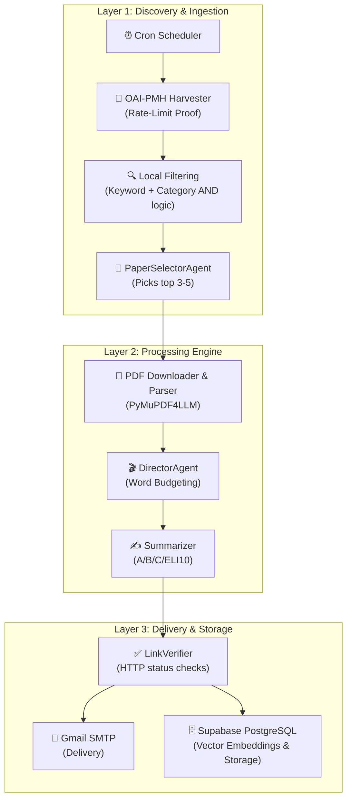

# 🧠 AI Research Paper Summarizer

An autonomous, resilience-first pipeline that discovers, curates, downloads, parses, and summarizes bleeding-edge research papers from arXiv. Built for cost-efficiency, it leverages OAI-PMH bulk data harvesting, CPU-based PDF parsing, and a multi-tiered LLM fallback chain to deliver high-quality, personalized research digests straight to your inbox.

---

## ✨ Features

- **📡 Rate-Limit Proof Discovery**: Harvests bulk metadata directly from `export.arxiv.org/oai2` (bypassing standard API blocks and Cloudflare WAF limits) with full `resumptionToken` pagination to ensure no paper is missed.
- **🎯 Intelligent Curation**: Uses a **Paper Selector Agent** to evaluate hundreds of candidate papers and dynamically select the top 3-5 most impactful ones per topic.
- **⏱️ Dynamic Word Budgeting**: The **Director Agent** actively balances word counts across selected papers, ensuring the final digest always takes between 15 and 25 minutes to read.
- **📄 Native CPU Parsing**: Uses `PyMuPDF4LLM` for extremely fast, layout-aware PDF extraction without requiring heavy GPU clusters or ML model downloads.
- **🔄 Zero-Cost Summarization**: A robust **LLM Client** that seamlessly falls back across free-tier endpoints. It prioritizes OpenRouter (specifically `google/gemma-4-31b-it:free` and the universal `openrouter/free` router) and falls back sequentially to Google AI Studio (Gemini) → DeepSeek → Cloudflare → Groq to guarantee 100% uptime with absolutely $0 cost.
- **🛡️ Hallucination Defense**: Built-in **Link Verifier** concurrently pings all generated URLs, automatically stripping out dead or hallucinated links before delivery.
- **🧠 A/B/C Summary Format**:
  - **A. The Issue**: Plain English explanation of the problem.
  - **B. The Solution**: Technical deep dive into the methodology.
  - **C. ELI10 / College Level**: Intuitive, relatable analogies for complex topics.

---

## 🏗️ Architecture



---

## 🚀 Quick Start

### 1. Clone & Install
Ensure you have Python 3.10+ installed.

```bash
# Clone the repository
git clone https://github.com/yourusername/Research_Paper_Summarizer.git
cd Research_Paper_Summarizer

# Create a virtual environment (optional but recommended)
python -m venv venv
source venv/bin/activate  # On Windows use: venv\Scripts\activate

# Install dependencies
pip install -r requirements.txt
```

### 2. Configure Environment
Copy the `.env.example` file to create your own `.env` file:

```bash
cp .env.example .env
```

Populate the `.env` file with your free-tier API keys. 
> **Note:** You do not need to provide all keys. The LLM Client will automatically use whatever keys are available, cascading down the fallback chain if a provider rate-limits you.

### 3. Run the Pipeline Locally
To run a local end-to-end smoke test for a given topic:

```bash
python run_cli.py
```
This will:
1. Load your API keys.
2. Expand the default topic ("AI Safety").
3. Harvest thousands of records from arXiv OAI-PMH.
4. Filter down to highly relevant hits.
5. Curate the top candidates using your active LLM.
6. Download the raw PDFs and parse them into Markdown.
7. Generate an insightful digest.
8. Verify links and save the final `.md` file to the `digests/` directory.

---

## 🛠️ Tech Stack & Constraints

- **Python 3.10+**: Core worker environment.
- **Requests / ElementTree**: Fast, robust HTTP client and XML parsing for OAI-PMH.
- **PyMuPDF4LLM**: Lightweight, GPU-free parsing.
- **Sentence-Transformers**: Local cross-encoder grounding (Day 2+).
- **Supabase**: Postgres / pgvector backend (Day 2+).

*Designed specifically to run flawlessly on low-cost/free VPS servers (like GitHub Actions) with zero GPU reliance.*